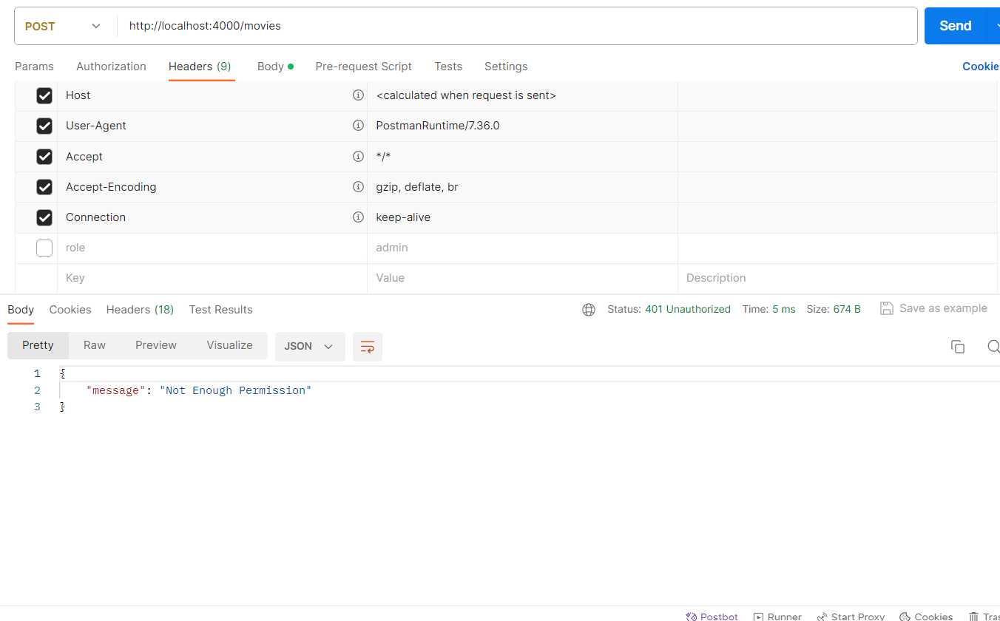
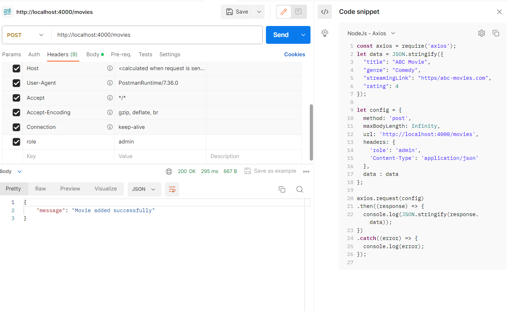

# Movie-ott Backend Repository

## Triggering Procedure
STEP 1 : Install Dependencies run npm install or npm i

STEP 2 : Run npm run start to start the server at http://localhost:4000

## Config
Can Edit Mongo Url Or Any Config In config/default.json path

## Rest Apis
Req Create Movie Api With No Permission:

Create Movies Api: http://localhost:4000/movies

Body:{
  "title": "ABC Movie",
  "genre": "Comedy",
  "streamingLink": "https/abc-movies.com",
  "rating": 4
}

Headers:  { 
    'Content-Type': 'application/json'
}

Response: {
    "message": "Not Enough Permission"
}

Req Create Movie Api With Permission:

Create Movies Api: http://localhost:4000/movies

Body:{
  "title": "ABC Movie",
  "genre": "Comedy",
  "streamingLink": "https/abc-movies.com",
  "rating": 4
}

Headers:  { 
    'Content-Type': 'application/json',
    'role': 'admin'
}

Response: {
    "message": "Movie added successfully"
}

